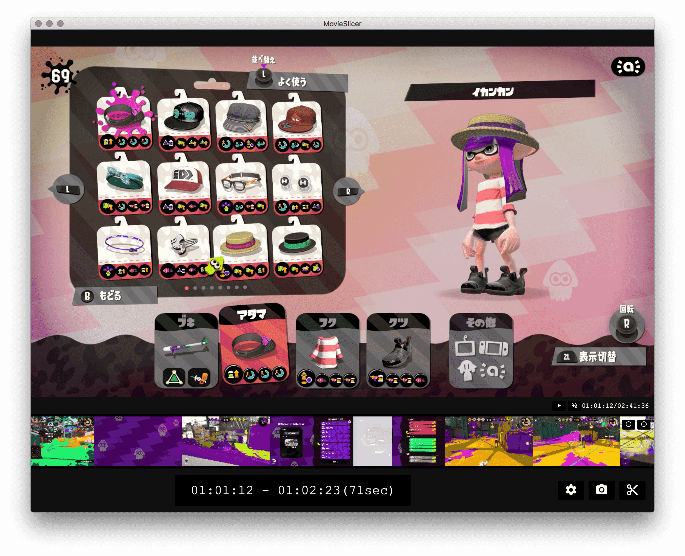

# movie-slicer

## Usage

- Drop your video
- Select ranges to slice with preview
- Slice it!

## Requirements

- `ffmpeg` and `ffprobe`
  - with `--enable-gpl --enable-libx264 --enable-libfdk-aac`

## Limitations
- Output codecs are limited
  - video: H.264
  - audio: AAC
